# niceColorbar

A drop-in, styled replacement for MATLAB's `colorbar` — six size/style presets, a
LaTeX-capable title and corner logo, light/dark/cobalt theme awareness, and
auto-refresh: change a property after the colorbar is built and it updates in
place, no rebuild call required. Works the same way on 2-D plots (`contourf`,
`imagesc`, ...) and 3-D plots (`surf`, ...), including through interactive
rotation/pan. Supports one instance per subplot on a shared figure (theme
changes stay in sync across all of them), plus one-line PNG/TIFF/PDF/FIG
figure export.

**First time here?** Follow this path: `QuickStart.m` (see it work) →
`doc/GettingStarted.m` (tour the commands/options) → `examples.m` (many more
worked examples).

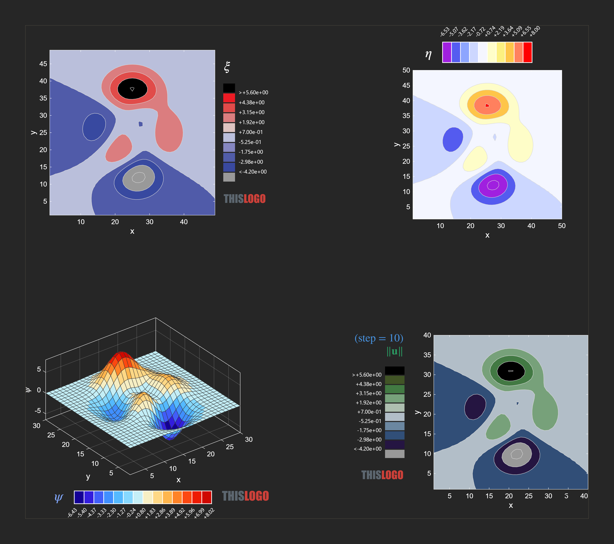

Dark mode niceColorbar samples.

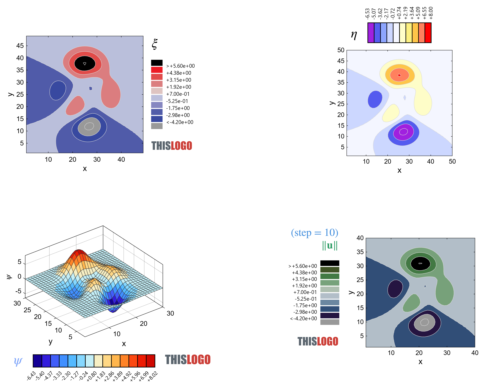

Light mode niceColorbar samples.

## Features

- Six size/style presets (`modern`, `modern.thin`, `modern.thick`, `ultra`,
  `ultra.thin`, `ultra.thick`) and any colormap `colormaplist()` recognizes,
  plus a set of custom colormaps unique to niceColorbar (see
  [Colormaps](#colormaps)).
- Auto-refresh: change a property after `colorbar()` has run and the live
  colorbar updates in place, no rebuild call required.
- LaTeX/TeX-capable, multi-line `Title`, with per-line color control via
  `TitleColor`.
- A corner `Logo` with independent per-segment coloring via inline
  `\color[rgb]{...}` tags.
- Light/dark/cobalt theme awareness (`ThemeMode`): an `'auto'` mode that
  follows MATLAB's current light/dark theme, plus explicit `'light'`,
  `'dark'`, and `'cobalt'` overrides, kept in sync across every instance on a
  shared figure.
- Togglable axes `Box` outline (`Box`, or `session()`'s `box.on`/`box.off`).
- Works the same way on 2-D plots (`contourf`, `imagesc`, ...) and 3-D plots
  (`surf`, ...), including through interactive rotation/pan.
- One instance per subplot on a shared figure — multiple colorbars stay
  independent without clobbering each other's layout or resize handling.
- `Side` placement: `'right'` (default), `'left'`, `'top'`, or `'bottom'`.
- Plain and capped color limits (`setLimits`/`setCappedLimits`/`resetLimits`),
  with configurable `CappedColorBelow`/`CappedColorAbove`.
- Auto-scaled tick labels with a common `×10ⁿ` exponent annotation
  (`TickLabelsAutoScale`), for data whose limits sit far from order-1.
- Independent visibility toggles for the bar, title, and logo
  (`ColorbarVisible`/`TitleVisible`/`LogoVisible`).
- One-line PNG/TIFF/PDF/FIG figure export (`saveAsPNG`/`saveAsTIFF`/`saveAsPDF`/`saveAsFIG`),
  with configurable export resolution (`ExportResolution`) and PDF render
  mode (`PdfRender`).
- `session()`: a keyboard-driven interactive console for adjusting a
  colorbar without writing throwaway script code.

The [Autoscale feature](#autoscale-feature) and [Interactive
session](#interactive-session) sections below cover two of these in more
detail.

## Requirements

- MATLAB R2024b or later (uses `arguments` blocks, property listeners, and
  `colormaplist()` on R2025b+; falls back to a fixed colormap list on older
  releases). Tested on R2024b Update 6 through R2026a.

## Installation

**Recommended**: install the packaged toolbox (`niceColorbar.mltbx`) via
MATLAB's Add-On Manager — double-click the file, or use Home → Add-Ons →
Install from file. This adds `niceColorbar` to the MATLAB path automatically
and lets you update/uninstall it through the Add-On Manager.

**For development** (working on the source directly): add the repository
folder to the MATLAB path instead:

```matlab
addpath('path/to/niceColorbar')
```

## Quick start

Also available as a runnable script: `QuickStart.m` in the repository root.

```matlab
% 1: create a plot
contourf(peaks);
xlabel("x","FontName","Arial","FontSize",18);           % put x-label
ylabel("y","FontName","Arial","FontSize",18);           % put y-label

% 2: Initial colorbar with title
nc = niceColorbar('modern.thick', 'autumn', 10);        % instantiate a niceColorbar object
nc.ThemeMode = "light";                                 % set theme mode
nc.Title = {'My title'};                                % set title
nc.Side = "top";                                        % colorbar location
nc.colorbar();                                          % create colorbar
nc.saveAsPNG();                                         % save figure as PNG image
nc.saveAsTIFF();                                        % save figure as TIFF image
nc.saveAsPDF();                                         % print figure to a PDF file
nc.saveAsFIG();                                         % save as MATLAB figure
```

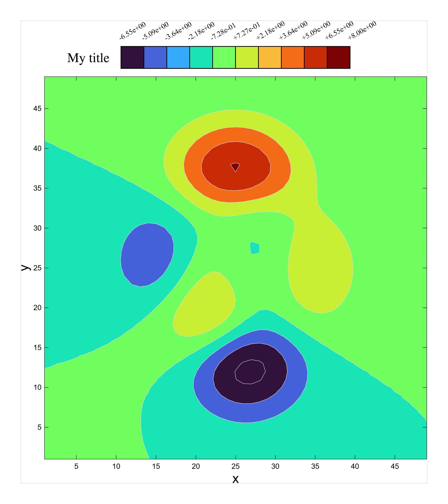

```matlab
% 3: Update colorbar (properties auto-refresh the live colorbar - no rebuild needed)
nc.Style = "ultra.thin";                                % update colorbar style
nc.Title = {'Updated','Title'};                         % update title
nc.TitleColor = {[0.28,0.32,0.95],[0.17,0.61,0.39]};    % custom color for updated title
nc.ColormapName = 'cool';                               % update colormap
nc.ThemeMode = "dark";                                  % update theme mode
nc.TickLabelsFontName = "Segoe UI";                     % update tick labels font
nc.TickLabelsFontSize = 12;                             % update tick labels font size
nc.Side = "left";                                       % update colorbar location
nc.TickLabelsFormat = '%+.2f';                          % update tick label format
nc.Logo = ['\color[rgb]{0.3608,0.4,0.43529}NICE',...    % put a logo
           '\color[rgb]{0.9,0.11,1.0}CLBR'];
nc.LogoFontName = "Impact";                             % set logo font name
nc.saveAsPNG();                                         % save figure as PNG image
nc.saveAsTIFF();                                        % save figure as TIFF image
nc.saveAsPDF();                                         % print figure to a PDF file
nc.saveAsFIG();                                         % save as MATLAB figure
```

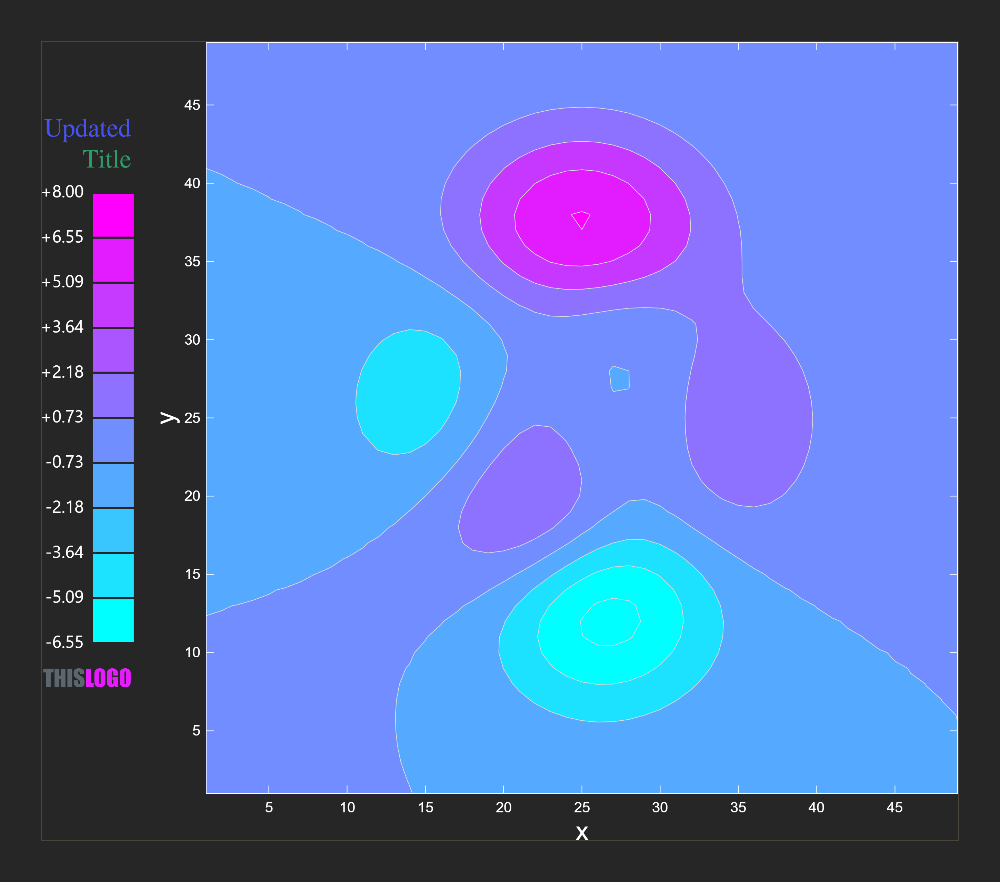

See `examples.m` for a multi-figure walkthrough (styles, LaTeX titles, logos,
per-line title colors, theme overrides) and `doc/GettingStarted.m` for a
guided tour.

## Autoscale feature

When a plot's values sit far from order-1 (e.g. limits like `[4990 5010]`),
raw tick labels get crowded and hard to read. Setting
`TickLabelsAutoScale = true` keeps `clim`/`Limits` in real data units, but
divides the tick *labels* by a common power of ten `n` (derived from the
current limits) and auto-prepends a `×10ⁿ` annotation above the bar, exactly
like MATLAB's classic axis exponent behavior. `TickLabelsAutoScaleDecimals`
controls how many decimal digits the scaled labels show (overriding
`TickLabelsFormat` while autoscale is on). On a 3-D axes, the plot's own Z
ruler is kept in lockstep — same exponent, same decimal count — so the
colorbar and the Z tick labels always agree.

```matlab
nc.TickLabelsAutoScale = true;         % autoscale tick labels and use
                                       % scientific notation with a common
                                       % exponent across all tick labels
nc.TickLabelsAutoScaleDecimals = 2;    % number of decimal digits shown
                                       % (TickLabelsFormat is ignored while
                                       % TickLabelsAutoScale is true)
```

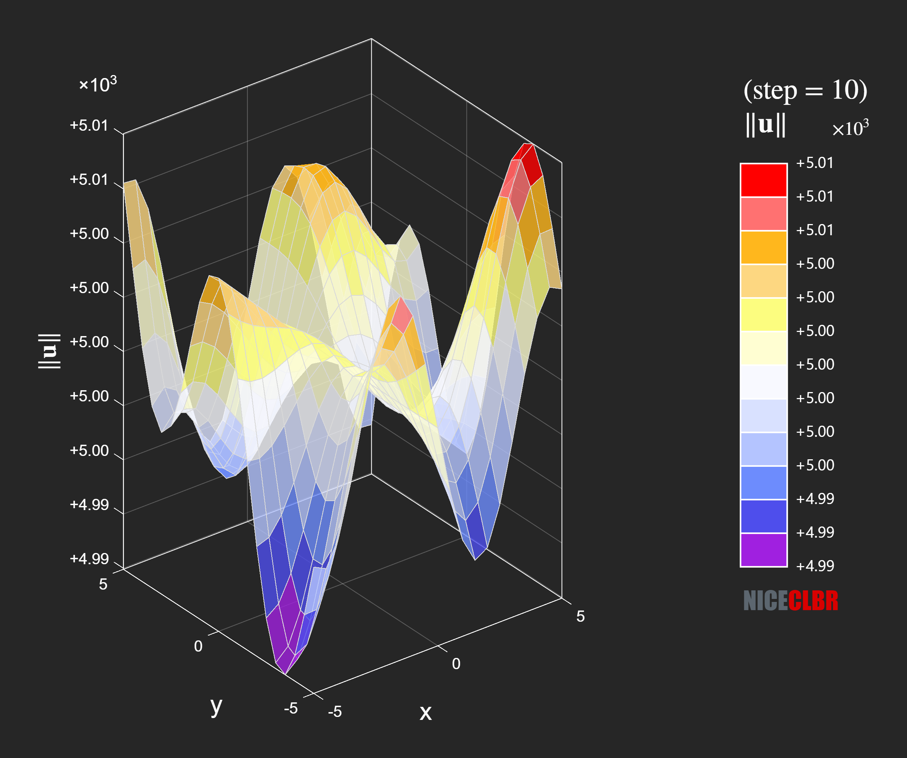

Autoscale for the colorbar located right.

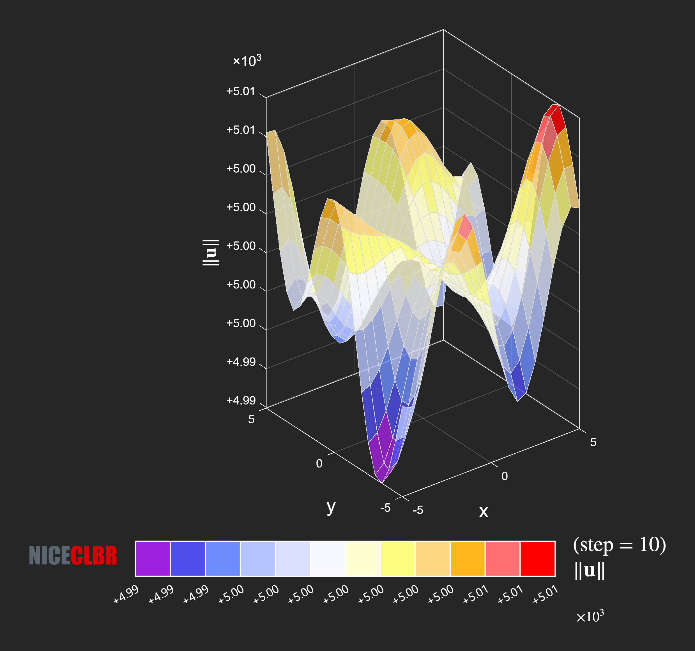

Autoscale for the colorbar located bottom.

## Interactive session

`niceColorbar.session()` is a keyboard-driven console loop for adjusting a
colorbar without writing throwaway script code — useful while exploring a
plot interactively. Call it after `colorbar()` has built at least one
instance:

```matlab
contourf(peaks);
nc = niceColorbar('ultra', 'parula', 8);
nc.colorbar();

niceColorbar.session();
```

```
niceColorbar interactive session.
Click a figure to target it, then enter a command below.
Commands: help, limits, limits.capped, limits.reset, style, colors, colormap, ...
niceColorbar>
```

Alternatively, if `niceColorbar.session()` was not placed in the `.m` file,
it can also be called directly from MATLAB's Command Window after the
script has run — the session targets whichever figure currently has focus,
so there's no need to add the call to the script beforehand.

Each command targets whichever figure currently has focus
(`groot().CurrentFigure`) at the moment it's entered — since MATLAB keeps
servicing figure-click events while the session waits on keyboard input,
clicking a different figure mid-session (e.g. switching from `Figure 2` to
`Figure 3`) redirects subsequent commands to that figure's own
`niceColorbar` instance, no need to exit and restart. Type `help` or `?`
at any time to reprint the command list; `exit` ends the session.

| Command | Effect |
|---|---|
| `help` / `?` | Reprints the command list. |
| `limits` | Prompts for a max. then min. value and calls `setLimits([min max])`. |
| `limits.capped` | Prompts for a max. then min. value and calls `setCappedLimits([min max])`. |
| `limits.reset` | Calls `resetLimits()`. |
| `style` | Prompts for a style name and assigns `Style`. |
| `colors` | Prompts for a color count and assigns `NumColormapColors`. |
| `colormap` | Prompts for a colormap name and assigns `ColormapName`. |
| `dark` / `light` / `cobalt` | Sets `ThemeMode` on every `niceColorbar` instance on the current figure. |
| `autoscale.on` | Prompts for a decimal count (blank = 2), assigns `TickLabelsAutoScaleDecimals`, then sets `TickLabelsAutoScale = true`. |
| `autoscale.off` | Sets `TickLabelsAutoScale = false`. |
| `box.on` / `box.off` | Toggles the axes' `Box`. |
| `hide.colorbar` / `show.colorbar` | Toggles `ColorbarVisible`. |
| `hide.title` / `show.title` | Toggles `TitleVisible`. |
| `hide.logo` / `show.logo` | Toggles `LogoVisible`. |
| `hide.all` / `show.all` | Toggles the bar, title, and logo together in one refresh. |
| `side.left` / `side.right` / `side.top` / `side.bottom` | Assigns `Side`. |
| `save.png` / `save.tiff` / `save.pdf` / `save.fig` | Opens a save dialog (`uiputfile`) and exports via `saveAsPNG`/`saveAsTIFF`/`saveAsPDF`/`saveAsFIG`. |
| `exit` | Ends the session. |

If no `niceColorbar` is registered on the current figure, commands that need
one print a message instead of erroring, so a stray keystroke or an
unfocused figure never breaks the loop.

## Reopening saved .fig files

A `.fig` saved via `saveAsFIG`/`session()`'s `save.fig` reopens with the
colorbar, title, and logo positioned exactly as they were, and — as long as
`niceColorbar` is on the MATLAB path of whatever session reopens it (see
below) — comes back as a fully live instance: auto-refresh, resize handling,
and `session()` support all keep working, not just the static image.

That last part only works because reopening a `.fig` re-triggers callbacks
(`CreateFcn`, `SizeChangedFcn`) that call back into the `niceColorbar` class
itself to rebuild the live object. If `niceColorbar` isn't resolvable in the
MATLAB session doing the reopening, those calls fail — typically the moment
you resize the figure, with an error like:

```
Unable to resolve the name 'niceColorbar.resizeHub'.
```

This has nothing to do with where the `.fig` file itself lives (e.g. on the
Desktop) — it's about whether `niceColorbar` is on the path of the session
that opens it. It's easy to hit this without noticing: double-clicking a
`.fig` file starts a fresh MATLAB session whose current folder is wherever
the file sits, and `niceColorbar` is only visible there if it's on your
**permanent, saved** MATLAB path — being on the path during the session that
originally *created* the figure is not enough.

**If you installed the packaged toolbox** (see [Installation](#installation)),
this is already handled — Add-On installation adds `niceColorbar` to the
saved path automatically.

**If you're working from the source folder**, make sure it's saved to your
path, not just added for the current session:

```matlab
addpath('path/to/niceColorbar')
savepath
```

`savepath` is what makes the entry persist into every future MATLAB session,
including one started by double-clicking a `.fig` file. Verify it took
effect from a fresh session (any `pwd`, not just the source folder):

```matlab
which niceColorbar -all
```

The first line listed is the copy that actually wins. If you keep more than
one copy of `niceColorbar` around (e.g. an installed release version plus a
separate source checkout you're developing against), `which niceColorbar
-all` also shows every shadowed copy in resolution order — useful for
confirming which one a reopened figure will actually call into, since only
the first match on the path is used.

## Char vs string arguments

Like MATLAB's own built-ins, most text arguments and properties accept either
a single-quoted character vector or a double-quoted string scalar
interchangeably:

```matlab
nc = niceColorbar("ultra", "parula", 8);   % same as 'ultra', 'parula'
nc.Style = "modern.thick";                 % same as 'modern.thick'
nc.Title = "My title";                     % a bare scalar - fine either way
```

Three specific spots don't follow that rule and must stay single-quoted char,
because of MATLAB char/string semantics differences that show up there:

- **`Title` / `Logo` cell entries** — `{'Line one', 'Line two'}` works;
  `{"Line one", "Line two"}` throws, because the underlying validator
  (`mustBeText`) rejects a cell array containing any `string` element (even
  an all-string cell). A bare scalar (`nc.Title = "My title"`, no braces) is
  unaffected and works with either quote style.
- **`TickLabelsFormat`** — must stay `'%.2f'`-style char. Setting it to a
  double-quoted string is accepted at assignment time but breaks the next
  `setCappedLimits(...)` call (the capped-mode tick formatter mixes an empty
  char `''` into a cell it expects to be uniformly char).
- **`Logo`/`Title` built via `[...]` concatenation** — e.g. the multi-color
  logo pattern below. With char literals, `[...]` concatenates them into one
  line; with double-quoted strings, `[...]` instead builds a multi-element
  string array, which is accepted silently but renders as separate lines
  instead of one — no error, just a wrong result:

  ```matlab
  % correct - one line, two colors
  nc.Logo = ['\color[rgb]{0.36,0.4,0.44}THIS', '\color[rgb]{0.8,0.25,0.22}LOGO'];

  % silently wrong - renders as two lines instead of one
  nc.Logo = ["\color[rgb]{0.36,0.4,0.44}THIS", "\color[rgb]{0.8,0.25,0.22}LOGO"];
  ```

These three cases are locked in by regression tests in `niceColorbarTest.m`.

## API

| Member | Description |
|---|---|
| `niceColorbar(style, colormapName, numColormapColors)` | Constructor. `style` is one of `'modern'`, `'modern.thin'`, `'modern.thick'`, `'ultra'`, `'ultra.thin'`, `'ultra.thick'` (defaults to `'ultra'`). `colormapName` is any name MATLAB's `colormaplist()` recognizes (default `'ultra'`). `numColormapColors` is a positive integer (default `8`). |
| `colorbar()` | Builds the colorbar on the current axes and wires up auto-refresh. |
| `setLimits(newLimits)` | Sets `clim` to `newLimits = [minVal maxVal]`. Requires `colorbar()` to have been called first. |
| `setCappedLimits(newLimits)` | Like `setLimits`, but caps out-of-range values to `CappedColorBelow`/`CappedColorAbove` instead of stretching the gradient. Requires `colorbar()` to have been called first. |
| `resetLimits()` | Reverts limits to what they were when `colorbar()` was first called, clearing capped mode. |
| `saveAsPNG(folder, fileName)` | Exports the attached figure as a PNG at `ExportResolution` DPI (default 300). Both arguments are optional — omitted, a name is auto-generated from the figure number and a timestamp and written to a `SavedFigures` folder inside the toolbox. |
| `saveAsTIFF(folder, fileName)` | Like `saveAsPNG`, but exports a TIFF at `ExportResolution` DPI. |
| `saveAsPDF(folder, fileName)` | Like `saveAsPNG`, but exports a PDF via `exportgraphics`, rasterized or vector depending on `PdfRender`. |
| `saveAsFIG(folder, fileName)` | Like `saveAsPNG`, but saves an editable MATLAB `.fig` file via `savefig`, re-openable with the colorbar and its styling intact. |
| `session()` *(static)* | Interactive console loop for adjusting the colorbar under keyboard focus (`limits`, `limits.capped`, `limits.reset`, `style`, `colors`, `colormap`, `dark`, `light`, `cobalt`, `autoscale.on`, `autoscale.off`, `box.on`, `box.off`, `hide.colorbar`, `show.colorbar`, `hide.title`, `show.title`, `hide.logo`, `show.logo`, `hide.all`, `show.all`, `side.left`, `side.right`, `side.top`, `side.bottom`, `save.png`, `save.tiff`, `save.pdf`, `save.fig`, `exit`). |

## Properties

All properties are `SetObservable` — assign a new value and the live colorbar
auto-refreshes in place, no rebuild call required.

| Property | Example |
|---|---|
| `ThemeMode` | `nc.ThemeMode = "dark";` |
| `Title` | `nc.Title = {'$u_{1,h}$'};` |
| `TitleInterpreter` | `nc.TitleInterpreter = "tex";` |
| `TitleFontName` | `nc.TitleFontName = "Arial";` |
| `TitleFontSize` | `nc.TitleFontSize = 20;` |
| `TitleFontWeight` | `nc.TitleFontWeight = "normal";` |
| `TitleColor` | `nc.TitleColor = "red";` |
| `Logo` | `nc.Logo = 'My Logo';` |
| `LogoFontName` | `nc.LogoFontName = "Arial";` |
| `LogoFontSize` | `nc.LogoFontSize = 14;` |
| `LogoFontWeight` | `nc.LogoFontWeight = "bold";` |
| `TickLabelsFontName` | `nc.TickLabelsFontName = "Arial";` |
| `TickLabelsFontSize` | `nc.TickLabelsFontSize = 12;` |
| `TickLabelsFontWeight` | `nc.TickLabelsFontWeight = "bold";` |
| `TickLabelsFormat` | `nc.TickLabelsFormat = '%.2f';` |
| `TickLabelsAutoScale` | `nc.TickLabelsAutoScale = true;` |
| `TickLabelsAutoScaleDecimals` | `nc.TickLabelsAutoScaleDecimals = 2;` |
| `TickLineWidth` | `nc.TickLineWidth = 1.5;` |
| `TickLineColor` | `nc.TickLineColor = "w";` |
| `Style` | `nc.Style = "modern.thick";` |
| `ColormapName` | `nc.ColormapName = "turbo";` |
| `NumColormapColors` | `nc.NumColormapColors = 12;` |
| `CappedColorBelow` | `nc.CappedColorBelow = [0.6 0.6 0.6];` |
| `CappedColorAbove` | `nc.CappedColorAbove = [0 0 0];` |
| `ColorbarVisible` | `nc.ColorbarVisible = "off";` |
| `TitleVisible` | `nc.TitleVisible = "off";` |
| `LogoVisible` | `nc.LogoVisible = "off";` |
| `Side` | `nc.Side = "top";` |
| `PdfRender` | `nc.PdfRender = "vector";` |
| `ExportResolution` | `nc.ExportResolution = 600;` |
| `Box` | `nc.Box = "off";` |

`ThemeMode` takes `'auto'` (default, follows MATLAB's current light/dark
theme), `'light'`, `'dark'`, or `'cobalt'` (a second, explicit-only dark
theme with no `'auto'` detection of its own). `ColorbarVisible`/
`TitleVisible`/`LogoVisible` each take `'on'`/`'off'` and independently
hide/show the bar, title, or logo in place, without discarding or rebuilding
anything; set all three to hide/show everything at once. `Side` takes
`'right'` (default), `'left'`, `'top'`, or `'bottom'` — which side of the
plot the colorbar, title, and logo are placed on; for `'top'`/`'bottom'` the
colorbar runs horizontally with the Title to its left and the Logo to its
right, both read horizontally. `PdfRender` takes `'image'` (default,
rasterized, fast) or `'vector'` (crisp/scalable, slower) and controls
`saveAsPDF`'s `exportgraphics` `ContentType`; `ExportResolution` is the
pixels-per-inch used by `saveAsPNG`, `saveAsTIFF`, and by `saveAsPDF` while
`PdfRender` is `'image'`. `Box` takes `'on'` (default) or `'off'` and
controls whether the axes' box outline is drawn.

Each niceColorbar instance tracks its own figure/axes, so multiple instances
(e.g. one per subplot, or one per docked figure) refresh independently.

## Colormaps

`ColormapName` accepts any name MATLAB's own `colormaplist()` recognizes
(`parula`, `turbo`, `jet`, `hot`, `cool`, ... — see [MathWorks' colormap
reference](https://www.mathworks.com/help/matlab/ref/colormap.html) for the
full built-in list), plus the following custom colormaps unique to
niceColorbar:

| Colormap Name | Color Scale |
|---|---|
| `darkjet` |  |
| `feap` | 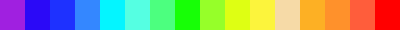 |
| `nice` | 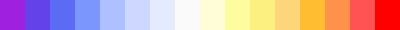 |
| `acefem` |  |
| `paraview` |  |
| `fast` |  |
| `robot` | 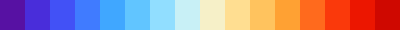 |
| `ultra` (default) |  |
| `adina` | 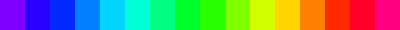 |
| `adina2` | 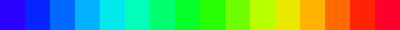 |
| `vemlab` |  |
| `watermelon` | 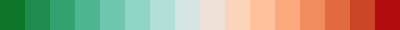 |
| `darkwatermelon` | 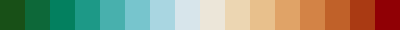 |
| `polar` |  |
| `roma` |  |
| `cork` |  |
| `lime` |  |
| `limediv` |  |
| `spectral` | 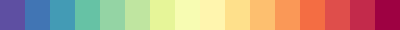 |
| `RdYlBu` |  |
| `simsolid` |  |

## Testing

Unit tests live in `niceColorbarTest.m` (`matlab.unittest` framework):

```matlab
runtests('niceColorbarTest')
```

## Author

Alejandro Ortiz-Bernardin, Associate Professor, Department of Mechanical
Engineering, Universidad de Chile.
([@aaortizb](https://github.com/aaortizb))

## License

BSD 3-Clause — see [LICENSE](LICENSE).

## How to cite

niceColorbar is free to use. If it contributes to a plot or figure that
appears in a publication, report, thesis, or other professional work, please
cite it:

> Ortiz-Bernardin, A. (2026). *niceColorbar* (Version 1.2.1) [MATLAB
> toolbox]. https://github.com/CAMLAB-UChile/niceColorbar

A [`CITATION.cff`](CITATION.cff) file is also included, which GitHub uses to
show a "Cite this repository" button and auto-generate BibTeX/APA formats
directly from the repo page.
